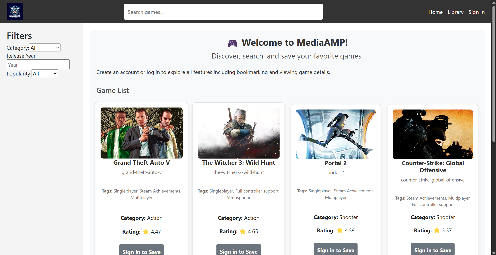
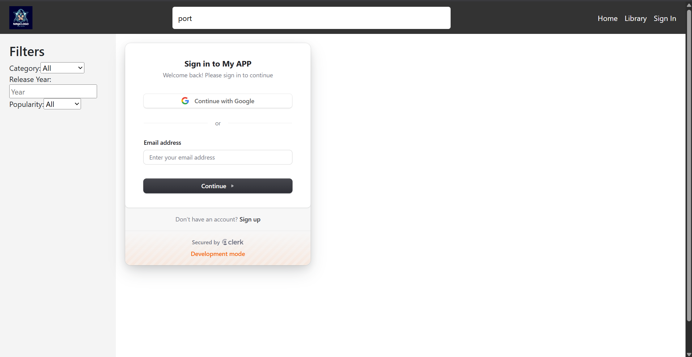
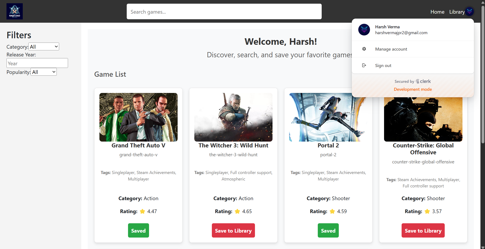
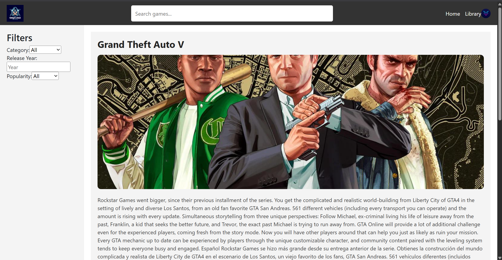
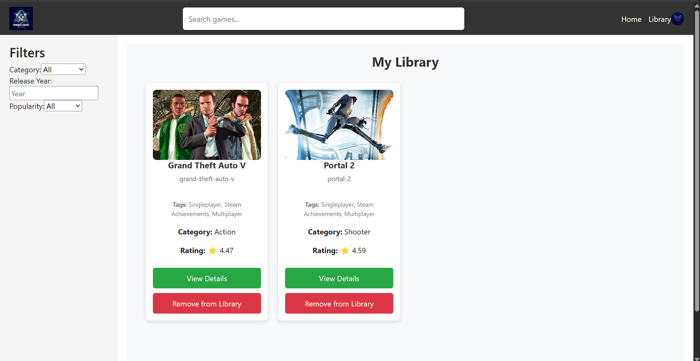
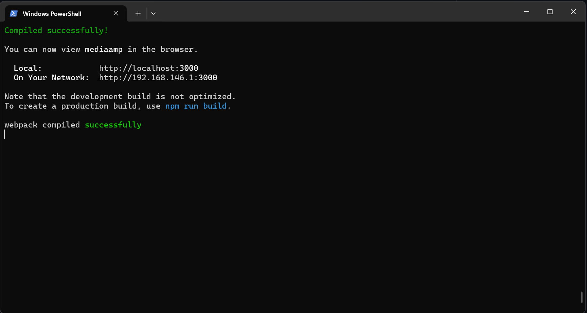

# 🎮 MediaAMP – Game Explorer Web App

**MediaAMP** is a beautifully animated, fully responsive web app built using modern web technologies and powered by the **RAWG Video Games Database API**. The app allows users to **search, explore, view details**, and **bookmark** their favorite games seamlessly, while maintaining a clean and professional UI/UX. Authentication is handled via **Clerk.dev**, and smooth animations are powered by **Framer Motion**.


   

---

## 📸 Preview

### 🔹 Home Page  


### 🔹 Sign In  
  


### 🔹 Game Detail View  
Explore detailed game descriptions with screenshots and trailers:  
  


### 🔹 Library – Saved Games  
A personalized section to revisit bookmarked games:  


### 🔹 Terminal – To Start The Server
We need to use "npm start" command to run the website.  


---

## 🚀 Features

- 🔍 **Search & Filter Games** – Search games by name or filter by genre, tags, and release year.
- 🔐 **User Authentication** – Secure login and sign-up using Clerk.
- 📚 **Save to Library** – Bookmark your favorite games for future reference.
- 🎬 **Game Detail View** – Access detailed game information, trailers, and screenshots.
- 🎨 **Framer Motion Animations** – Smooth page transitions and hover effects.
- 📱 **Responsive Design** – Fully optimized for mobile, tablet, and desktop devices.

---

## 🛠️ Technologies Used

### 1. Frontend: **React**
A powerful JavaScript library for building dynamic user interfaces. React enables a component-based architecture that makes your code clean and reusable.

### 2. Authentication: **Clerk.dev**
A modern authentication platform that simplifies user management, including secure login, sign-up, and session persistence.

### 3. State Management: **Redux Toolkit**
Used to manage the state of bookmarks, filters, and themes efficiently, ensuring consistent data flow across the app.

### 4. Animations: **Framer Motion**
An animation library for smooth transitions, hover effects, and fade-ins that elevate the app's user experience.

### 5. API: **RAWG Video Games Database API**
Provides a vast repository of game data, including descriptions, images, genres, tags, and ratings.
 
---

## 📋 Step-by-Step Project Workflow

Let’s walk through what happens from the moment a user opens the app:

### 🏁 1. Home Page
- The app welcomes users with a beautifully structured home page displaying game listings.
- Game data is fetched from the **RAWG API** in real-time.
- Users can explore games using:
  - 🔍 Search bar
  - 🎯 Filters: Genre, Release Year, Tags, etc.

### 🔐 2. User Authentication
- Users can sign in or sign up using **Clerk.dev**.
- Authenticated users have access to a personalized library and persistent sessions.

### 🎮 3. Explore Games
- Clicking on a game card opens a detailed view, which includes:
  - Game name, description, genre, platforms, and ratings.
  - 🎞️ Trailer and 📷 Screenshots in a visually appealing carousel.

### 📌 4. Save Games to Library
- Users can bookmark games and access their saved library.
- Redux ensures that bookmarked games are persistent across sessions.

### 🎨 5. Animations
- Page transitions, button hover effects, and image fade-ins are powered by **Framer Motion**, ensuring smooth interactions.

### 🧾 6. State Management
- Redux Toolkit handles the application's global state, including:
  - Filters
  - Theme toggling
  - Bookmark storage

---

## 🧱 Tech Stack

| Category        | Stack/Library         |
|----------------|-----------------------|
| Frontend       | React, React Router   |
| State Mgmt     | Redux Toolkit         |
| UI Styling     | React-Bootstrap, CSS  |
| Animations     | Framer Motion         |
| Auth           | Clerk.dev             |
| API            | RAWG Games API        |

---

## ⚙️ Getting Started

### ✅ 1. Clone the Repository

```bash
git clone https://github.com/harshverma724/MediaAMP-front-end-Project.git
cd MediaAMP-front-end-Project
```

### 📦 2. Install Dependencies

```bash
npm install
```

### 🔑 3. Set Up API Key and Clerk Authentication

1. Obtain an API key from [RAWG API Docs](https://rawg.io/apidocs) and set up a project on **Clerk.dev**.
2. Create a `.env` file in the root directory and add:
   ```env
   REACT_APP_RAWG_API_KEY=your_rawg_api_key
   VITE_CLERK_PUBLISHABLE_KEY=your_clerk_key
   ```

### 🚴 4. Run Development Server

```bash
npm run dev
```

Your app will be live at: `http://localhost:5173`

### 🛠 Additional Commands

- **Build for Production**:
  ```bash
  npm run build
  ```
- **Preview Build**:
  ```bash
  npm run preview
  ```

---

## 📢 Deployment Options

The project can be deployed using platforms like:
- [Vercel](https://vercel.com)
- [Netlify](https://www.netlify.com)
- GitHub Pages (with build export)

---

## 📜 Acknowledgments

- 🎮 **RAWG API** for game data.
- 🧑‍💻 **Clerk.dev** for authentication.
- ⚛️ **React, Redux, Framer Motion** for building and designing the app.

---

# ✨ Author

Made with ❤️ by **Harsh Verma**  
[Portfolio](https://harshverma724.github.io/Portfolio-Website) • [LinkedIn](https://linkedin.com/in/harshverma724)

---
