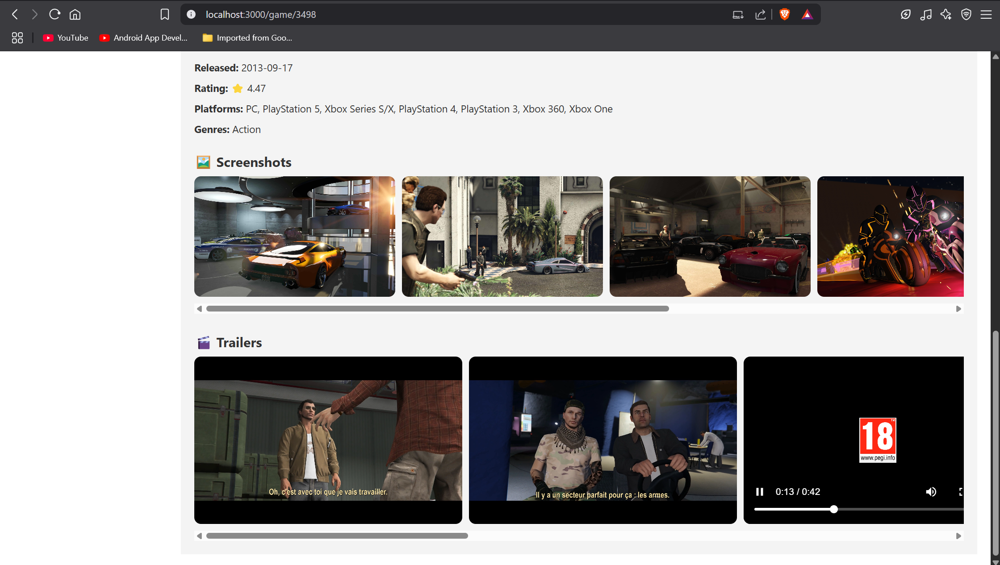

# 🎮 MediaAMP

**A stunning game browser built with React + RAWG API.**  
Discover, search, filter, and save your favorite games in one place. Beautifully animated and fully responsive.


---

##  Preview

### 🔹 Home Page


### 🔹 Sign in Option


### 🔹 Game Detail View





### 🔹 Bookmarked Library


### 🔹 Terminal


---

## 📌 Features

- 🔍 **Search & Filters**: Find games by name, category, release year, and tags.
- 🌙 **Dark Mode**: Toggle between light and dark themes.
- 🔐 **Authentication**: Sign up/login with Clerk for a personalized experience.
- 💾 **Bookmark Games**: Save your favorite games to a personal library.
- 🎥 **Game Trailers**: Watch trailers and preview screenshots.
- ⚡ **Smooth Animations**: Powered by Framer Motion.
- 📱 **Fully Responsive**: Works on all devices — mobile, tablet, and desktop.

---

## 🚀 Tech Stack

| Frontend         | Features/Packages |
|------------------|-------------------|
| React            | Functional Components, Hooks |
| Redux Toolkit    | State Management |
| Clerk Auth       | Authentication |
| Framer Motion    | Animations |
| RAWG Video Games API | Game Data |
| React-Bootstrap  | UI Components |
| Vanilla CSS      | Styling |
| React Router     | Routing |

---

## 🔧 Getting Started

### 1. Clone the Repository

```bash
git clone https://github.com/your-username/mediaamp.git
cd mediaamp
```

### 2. Install Dependencies

```bash
npm install
```

### 3. Set up Clerk Authentication

> ⚠️ Create a Clerk project at [https://clerk.dev](https://clerk.dev) and get your frontend API key.

```env
VITE_CLERK_PUBLISHABLE_KEY=your_clerk_publishable_key
```

### 4. Run the App

```bash
npm run dev
```

---

## 🌐 Live Demo

> 📌 [Coming Soon – Hosted on Vercel/Netlify](#)

---

## 💡 Project Structure

```
📦 mediaamp/
├── 📁 public/
├── 📁 src/
│   ├── 📁 components/
│   │   ├── Home.js
│   │   ├── Library.js
│   │   └── GameDetail.js
│   ├── 📁 redux/
│   │   └── gameSlice.js
│   ├── App.js
│   ├── index.js
│   └── styles.css
├── 📁 screenshots/
├── package.json
└── README.md
```

---

## 🙌 Acknowledgments

- 🕹️ [RAWG Video Games Database API](https://rawg.io/apidocs)
- 🔒 [Clerk.dev](https://clerk.dev) for seamless authentication
- ⚛️ React, Redux, Framer Motion

---

## ✨ Author

Made with ❤️ by **Harsh Verma**  
[Portfolio](https://harshverma724.github.io/Portfolio-Website) • [LinkedIn](https://linkedin.com/in/harshverma724)

---

## 📄 License

This project is licensed under the [MIT License](LICENSE).